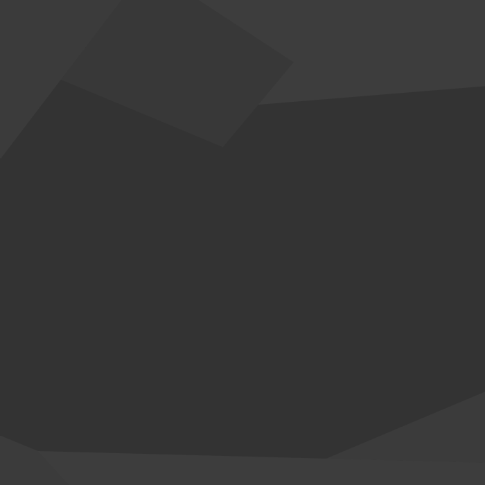
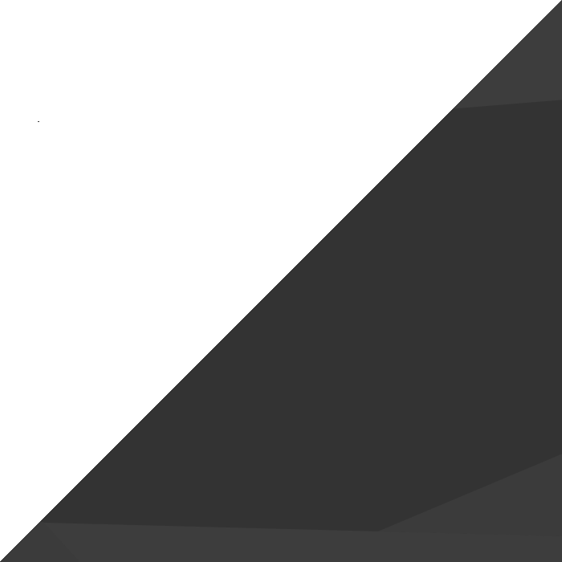
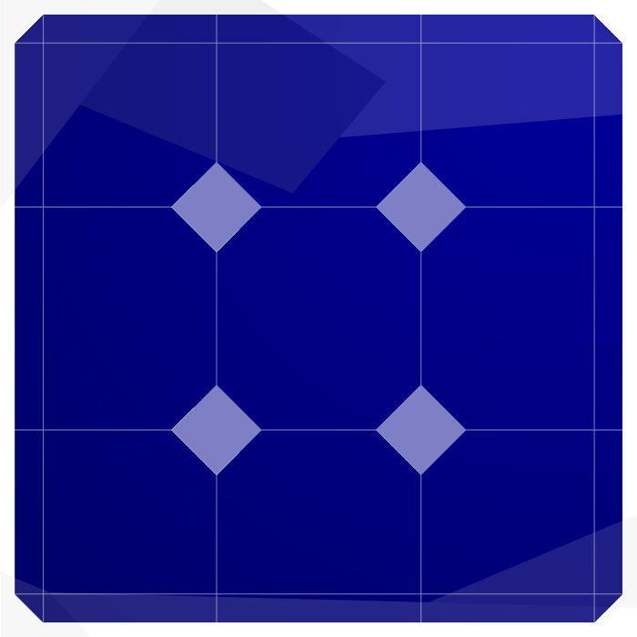
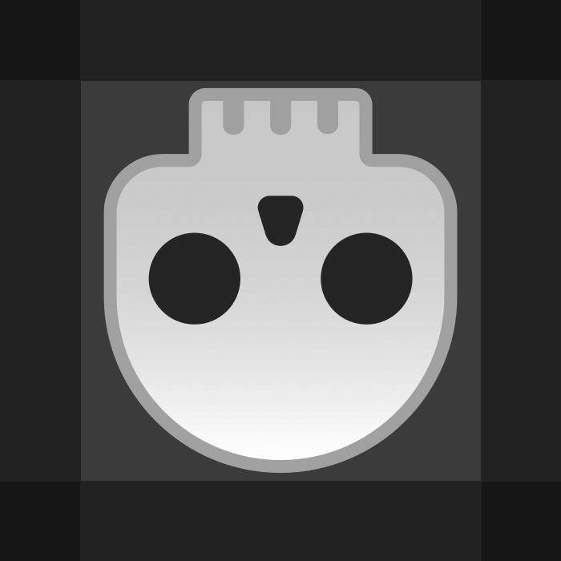

# VEX++

This is a game that i made to be an improvement to the games [vex](https://www.newgrounds.com/portal/view/609073), [vex 2](https://www.newgrounds.com/portal/view/620004), and [vex 3](https://www.newgrounds.com/portal/view/643827) by adding many new features.

## Table of Contents

- [Extra Info](#extra-Info)
- [Controls](#Controls)
- [Settings](#Settings)
- [Blocks](#Blocks)
- [Command Line Arguments](#Command-Line-Arguments)
- [Extra](#extra)

  - [Custom Editor Bar Block Placements](#custom-Editor-Bar-Block-Placements)

- ## Extra Info

  - press editor_edit_special on a block in the block picker to modify the default options of that block that will be used when first placing it
  - launcher not required, but allows easy access to any old version, and allows you to know when there is an update whenever opening the launcher.
  - launcher also has a button to update the launcher

<!-- start auto -->
<!--
    - **canAttachToPaths**: allows this block to attach to paths
    - **color**: sets the modulate property
    - **path**: a string of points separated by commas each being an x, then y, that are used to make the path. the points are relative to the path node, not global positions.
    - **endReachedAction**: what will happen when the block reaches the end of the path.
    - **startOnLoad**: when the level is loaded or the player dies the track will start immediately.
    - **startWhenSignalReceived**: starts to move when its signal is activated.
    - **startWhileSignalReceived**: starts to move when its signal is activated and pauses when the signal is deactivated.
    - **signalInputId**: the id of the signal it is listening for
    - **restart**: only available when using a button start mode.
    - **forwardSpeed**: the speed that blocks are moved at while going forward along the path.
    - **backwardSpeed**: the speed that blocks are moved at while going backwards along the path.
    - **addNewPoint**: creates a new point right after this in the path
    - **canAttachToThings**: allows the block to attach to other things that are not paths, for paths change **canAttachToPaths**
    - **signalOutputId**: the id that will be sent
    - **level**: the level that you will be sent to
    - **requiredLevelCount**: the amount of levels that you must beat before being able to enter this level
    - **multiUse**: if true you can recollect this checkpoint else this checkpoint will only be collectable once
    - **contactOption**: what to do when the player enters it
    - **direction**: the direction it will move, user means the direction the player is facing when grabbing it
    - **maxCooldown**: the time between each shot
    - **maxCount**: the maximum amount of bouncing shurikens that can be spanwd from this block at a time
    - **killAfterDistance**: kills bouncing shurikens it's spawned if they pass this value
    - **killAfterTime**: bouncing shurikens that this has spawned will be killed after the set time
    - **unCollect**: temporarily uncollects the star
    - **starType**: the color of the star
    - **groupId**: if not 0 when one is triggered all other falling spikes with the same groupId will also start falling
    - **exitId**: the id this portal uses to find its exit portal
    - **portalId**: the id of this portal as used for finding an exit portal
    - **text**: text to show
    - **action**: the action to detect
    - **state**: the state to detect
    - **signalAInputId**: a signal to detect
    - **signalBInputId**: other signal to detect
    - **enableSignalInputId**: the signal id that when received will cause this to start sending it's signal
    - **disableSignalInputId**: the signal id that when received will cause this to stop sending it's signal
    - **persistAfterDeath**: if true the state will be saved when collecting checkpoints
    - **startOn**: if true will start enabled else will start disabled
    - **chargeTime**: the time it takes for a signal to be charged up
    - **onSignalDeactivationWhileCharging**: what happens when its signal is deactivating while charging
    - **dischargeTime**: the time it takes for a signal to be discharged
    - **onSignalActivationWhileDischarging**: what happens when its signal is activating while discharging
    - **id**: the ziplines with the same id will be connected
-->

- ## Controls

  - **show_keybinds**: can show and hide the control rebind menu while editing a level - control editor starts visible on the main menu
  - **jump**: causes the player to jump and if the camera will refocus the player
  - **down**: causes the player to crouch or slide while on the ground and if in the air will cause the player to be able to break glass when fell on
  - **left**: causes the player to move left
  - **right**: causes the player to move right
  - **editor_select**: when pressed while hovering over a block it will select the block under your mouse cursor. move the mouse while pressed to move the selected block
  - **editor_edit_special**: when pressed while hovering over a block it in the block picker will allow you to edit defaults for that block
  - **editor_scale**: hold this button to switch from moving blocks with editor_select to scaling blocks
  - **editor_rotate**: hold this button to switch from moving blocks with editor_select to rotating blocks
  - **editor_delete**: press this while selecting a block with editor_select to delete it from the level
  - **duplicate_block**: press this to create a copy of the last selected block
  - **editor_pan**: press this to enable pan mode, in which instead of moving the blocks with editor_select you scroll around the level instead
  - **move_player_to_mouse**: when pressed the player will teleport to the mouse position
  - **restart**: only available when using a button start mode.
  - **full_restart**: resets the player to the level start
  - **save**: saves the current level
  - **open_main_menu**: opens the main menu
  - **reload_map_from_last_save**: reloads the map from the level file and restores the player position to the last checkpoint or the level start if no checkpoint was reached
  - **fully_reload_map**: reloads the map from the level file and resets the player to the level start
  - **quit**: quits the game
  - **toggle_hitboxes**: toggles hitboxes visibility on and off - sometimes won't update the hitboxes correctly, so to fix press reload_map_from_last_save/fully_reload_map and hitboxes will update correctly
  - **new_map_folder**: press to create a new map, which can be a collection of levels all able to access each other through the "inner level" block
  - **new_level_file**: press to create a new level, inside the current map folder
  - **toggle_fullscreen**: toggles fullscreen temporarily and is reverted when reopening the game. to change the default screen mode go to the settings
  - **toggle_pause**: toggles the moving blocks in the level - only meant for editing, and is not meant to be used to beat levels
  - **editor_disable_grid_snap**: hold to set the grid snap to 1px to allow for more precise editing.
  - **editor_box_select**: hold to create a box select that selects all blocks within it to allow moving them together
  - **move_selected_left**: moves the last selected block 1 grid step left.
  - **move_selected_right**: moves the last selected block 1 grid step right.
  - **move_selected_up**: moves the last selected block 1 grid step up.
  - **move_selected_down**: moves the last selected block 1 grid step down.
  - **exit_inner_level**: when pressed while inside an inner level it will taky you up 1 level, if the level you are in has not been beaten before no data will be saved even if stars had been collected, if it has been beaten before then stars will be saved when exiting a level this way.
  - **toggle_hide_non_ghosts**: when in editor and this is enabled all non ghost blocks are hidden.
  - **block_z_up**: moves the block back in the list of nodes to make it render before the other blocks. the selected block is moved up until it is before 1 block that it is currently in front of and not just by 1.
  - **block_z_down**: same as block_z_up but moves it down instead of up.
  - **invert_single_axis_align**: hold while moving a block to invert the value of singleAxisAlignByDefault.
  - **edit_level_mods**: press to toggle the level mod editor on and off.
  - **activate_temporary_checkpoint**: when pressed will save the players current location as a temporary checkpoint
  - **copy_block_position**: copies the last selected blocks position
  - **copy_block_scale**: copies the last selected blocks scale
  - **copy_block_rotation**: copies the last selected blocks rotation
  - **paste_block_position**: sets the rotation of the current block to that of the last copied rotation
  - **paste_block_scale**: sets the last selected blocks scale to the last copied scale
  - **paste_block_rotation**: sets the last selected blocks rotationthat the last copied rotation
  - **focus_on_player**: focuses the player and disables edit mode
  - **focus_search**: focuses the search bar
  - **toggle_tab_menu**: toggles the visibility of the tab menu
  - **lock_selected_block**: locks the last selected block preventing it from being selected again until the level is reloaded
  - **accept_autocomplete**: accepts the autocomplete option that is currently selected
  - **copy_debug_info**: copies some info
  - **eval_expr**: evauates an expression - only useful for debugging
  - **toggle_noclip**: toggles noclip for the player
  - **"CREATE NEW - _block name_"**: creates a new instance of _block name_ the same is if it was picked from the editor bar.

- ## Settings
  - ### grid

    - **showGridInEdit**: shows the grid in when in edit mode.
    - **blockGridSnapSize**: the size of the grid that blocks will snap to when being moved or resized.
    - **showGridInPlay**: shows the grid in when in play mode.
  - ### save

    - **autosaveInterval**: how long in seconds between autosaves. 0 is disabled
    - **saveOnExit**: saves the level when opening the menu - make work on game close and on enter inner level
    - **smallerSaveFiles**: makes all save files smaller by removing unnecessary padding, which also makes it harder to read
    - **saveLevelOnWin**: save the level when you win it.
    - **showIconOnSave**: shows a save icon when the level is saved. low opacity when save stared and fully visible when saving finished.
  - ### window

    - **windowMode**: changes the default window mode (fullscreen/windowed)
      - **fullscreen**: fullscreen
      - **windowed**: windowed
  - ### warnings

    - **dontShowInvalidBlocksInEditorBarEvenWhenReorganizingEditorBar**: when this is enabled invalid blocks don't get shown whenever reorginizing editor bar is enabled
    - **warnWhenOpeningLevelInOlderGameVersion**: when you open a level in an older version of the game, you will be warned that it may not work properly.
    - **warnWhenOpeningLevelInNewerGameVersion**: when you open a level in an newer version of the game, you will be warned that it may not work properly.
    - **confirmKeyAssignmentDeletion**: adds a confirmation dialog before removing keys from the keybinds list.
    - **confirmLevelUploads**: if true level uploads must be confirmed, otherwise there will be no confirmation
  - ### editor settings

    - ### rotation

      - **newlyCreatedBlocksRotationTakesPlayerRotation**: if true when the player is rotated all new blocks that can be rotated will be rotated to the players current direction instead of the default direction, eg if the player has gravity upside down creating a checkpoint will create it upside down.
      - **mouseLockDistanceWhileRotating**: this is how far away the mouse will be from the center of the selected object while holding the editor_rotate key. higher numbers move the mouse farther away. set to 0 to disable.
      - **multiSelectedBlocksRotationScheme**: what happens when rotating a block with selecting more than 1
      - **rotateAllSelectedBlocksBySameAmount**: ?
      - **rotateAllSelectedBlocksToSameDirection**: ?
    - ### displacement

      - **movingPathNodeMovesEntirePath**: if true moving this will move the entire path, if false it will only move the first point
      - **minDistBeforeBlockDraggingStarts**: the distance the mouse has to move before the block will be moved or scaled
      - **singleAxisAlignByDefault**: if true blocks will only be movable along a single axis at a time by default. if false blocks can be moved freely.
    - ### scaling

      - **noCornerGrabsForScaling**: when grabbing a block at a corner it will only resize the bnlock on the side that had less grab area.
    - ### deletion

      - **deleteLastSelectedBlockIfNoBlockIsCurrentlySelected**: if false then to delete a block you must be currently selecting it, if true then pressing delete will always remove the block that was selected most recently.
    - ### panning

      - **autoPanWhenClickingEmptySpace**: when dragging on an empty space, with no blocks on it, it will treat it as if editor_pan was pressed.
      - **editorScrollSpeed**: changes the speed the camera moves at when using editor_pan
    - ### editor bar

      - **editorBarBlockSize**: the size of the block picker in pixels. changing this makes the blocks in the block picker and the block picker height equally larger or smaller
      - **editorBarScrollSpeed**: changes the speed of scrolling through the editor bar. set negative to invert scroll direction
      - **editorBarOffset**: can be used to place the editor bar a the bottom of the screen instead of the top, or just shift it down a bit to prevent it from being covered by other programs while in fullscreen or when the window is otherwise at the top of the screen
      - **editorBarColumns**: the amount of columns in the editor bar. if you want a horizontal layout just make this number large and if using a vertical layout make this number small.
      - **editorBarPosition**: moves the editor bar to either top, bottom, left, or right of the screen
        - **top/left**: the editor bar will be at the topleft of the screen
        - **bottom**: the editor bar will be at the bottom of the screen
        - **right**: the editor bar will be at the right of the screen
      - **reorganizingEditorBar**: enable to setart reorginizing the editor bar by dragging the blocks around
      - **showEditorBarBlockMissingErrors**: shows an error if a block in the editor bar doesn't exist in the game
  - ### limits

    - **allowRotatingAnything**: allows rotating any blocks regardless of if it is meant to be rotated or not.
    - **allowScalingAnything**: allows scaling any blocks regardless of if it is meant to be rotated or not.
  - ### camera

    - **snapCameraToPixels**: makes some blocks render better, like the disabled solar blocks, by rounding the camera position, but could cause some less smooth looking movement
    - **cameraZoomInEditor**: the zoom of the camera while in the editor - making is smaller than 1 breaks the grid
    - **cameraZoomInPlay**: the zoom of the camera while playing - making is smaller than 1 breaks the grid
    - **cameraUsesDefaultRotationInEditor**: makes is so that when the editor ui is shown the camera is reset to default rotation instead of keeping the last rotation.
    - **dontChangeCameraRotationOnGravityChange**: makes is so that when when the gravity changes the camera will not be rotated.
    - **cameraRotationOnGravityChangeHappensInstantly**: makes is so that when the gravity changes the camera rotates instantly instead of rotating smoothly.
  - ### theme

    - ### editor theme

      - ### editor block theme

        - **blockGhostAlpha**: changes the alpha of the ghost blocks - used to show where a block is actually placed suchas keys that have been collected, moving blocks that are moving, etc.
        - **selectedBlockOutlineColor**: the outline color of the currently selected block
        - **hoveredBlockOutlineColor**: the outline color of the current hovered block
        - **blockOutlineSize**: the size of the block outline both for hover and select
        - **pathColor**: the color of the path created in the level editor by the path block.
      - **boxSelectColor**: the color that the box select will be
      - **levelTilingBackgroundPath**: this image will be tiled across the level.
      - **editorBackgroundPath**: path to the background image for the editor.
      - **editorBackgroundScaleToMaxSize**: if true the background image will scale to fit the screen.
      - **editorStickerPath**: path to the sticker image for the editor.
    - **theme**: the theme used for the entire application.
      - **default**: default godot theme
      - **blue**: blue
      - **black**: black
  - ### info

    - ### hovered block list

      - **showHoveredBlocksList**: if true will show a list of the blocks under the mouse
      - **selectedBlockFormatString**: string showing how to format the data for the selected block
      - **hoveredBlockFormatString**: string showing how to format the data for the hovered blocks (pxx/pxy size in px x/y, sx/sy is scale x/y, posx/posy is position x/y, rot is rotation in degrees, id is the blocks id, layer is the layer that the block is on)
    - ### signals

      - ### signal display

        - **showSignalListInEditor**: if true, while in the editor, a list of all signals, the blocks that are sending the signals and weather or not the signal is active
        - **showSignalListInPlay**: if true, while not in the editor, a list of all signals, the blocks that are sending the signals and weather or not the signal is active
        - **showTotalActiveSignalCounts**: adds a number showing the total amount of signals that are currently sending on each signal id
        - **showWhatBlocksAreSendingSignals**: adds an image of the block that is sending on each signal id and a number showing the amount of blocks of the same type that are sending the signal
        - **onlyShowActiveSignals**: only shows signals if the signal is active and being sent
      - ### signal connection lines

        - **showSignalConnectionLinesOnHover**: shows lines between all blocks connected by signals to the block being hovered or selected
        - **showSignalConnectionLinesInEditor**: shows lines between all blocks connected by signals when in the editor
        - **showSignalConnectionLinesInPlay**: shows lines between all blocks connected by signals when not in the editor
        - **onlyShowSignalConnectionsIfHoveringOverAny**: if true and hovering over or selecting a block that is connected, only connections for that block will be shown even if showSignalConnectionLinesInEditorshow or SignalConnectionLinesInPlay are true
    - ### level mods

      - **showLevelModsWhileEditing**: if true the level modifiers will be shown in the editor
      - **showLevelModsWhilePlaying**: if true the level modifiers will be shown while playing
      - **showUnchangedLevelMods**: if true the level modifiers will be shown even if the value is the same as the default
    - **showLevelLoadingProgressBar**: shows a progress bar for loading levels.
    - **showLevelLoadingBehindProgressBar**: shows the blocks being placed when loading a level. otherwise shows a grey background behind the loading bar instead.
    - ### paths

      - **showPathBlockInPlay**: the path block, showing where the path starts, will be visible in play mode.
      - **showPathLineInPlay**: the path line, showing the path attached blocks will travel, will be visible in play mode.
      - **showPathEditNodesInPlay**: the path edit nodes, showing where each segment of the the path is at, will be visible in play mode.
    - ### UNAVAILABLEs

      - **showUNAVAILABLEBlockInPlay**: shows unavailable blocks when playing
  - ### player

    - **playerRespawnTime**: the time that the player takes to respawn after dying
  - ### level lists

    - ### local level list

      - **smallLevelDisplaysInLocalLevelList**: makes the level displays for local levels smaller
      - **amountOfLevelsToLoadAtTheSameTimeOnMainMenu**: the amound of levels to load data for each frame when on the menu
      - **showLevelCompletionInfoOnMainMenu**: shows some info about if the levels are completed and how completed they are on the menu
    - ### online level list

      - **smallLevelDisplaysInOnlineLevelList**: makes the level displays for online levels smaller
      - **onlyShowLevelsForCurrentVersion**: the load online levels button only shows levels for the current version instead of for all versions.
      - **loadOnlineLevelListOnSceneLoad**: when the online level list is loaded the level data will immediately be downloaded
  - ### level creation

    - **defaultCreatorName**: the default name for the prompt when creating a new level
    - **defaultCreatorNameIsLoggedInUsersName**: if true overites defaultCreatorName to be the username of the currently logged in user
    - **randomizeLevelModifiersOnLevelCreation**: when creating a new level the level modifiers will be set randomly
  - ### debug

    - **toastStayTime**: how long the toast stays on screen in seconds.
    - ### hitboxes

      - **showHitboxesByDefault**: sets the default hitbox state for whenever entering a level
      - ### solid hitboxes

        - **solidHitboxColor**: the color of the hitbox of the solids
        - **showSolidHitboxes**: if true the solid hitboxes will be visible when hitboxes are shown
      - ### attach detector hitboxes

        - **attachDetectorHitboxColor**: the color of the hitbox of the attach detecors
        - **showAttachDetectorHitboxes**: if true the attach detector hitboxes will be visible when hitboxes are shown
      - ### area hitboxes

        - **areaHitboxColor**: the color of the hitbox of the areas
        - **showAreaHitboxes**: if true the non deadly area hitboxes will be visible when hitboxes are shown
      - ### death hitboxes

        - **deathHitboxColor**: the color of the hitbox of the deadly areas
        - **showDeathHitboxes**: if true the deadly area hitboxes will be visible when hitboxes are shown
  - ### autocomplete

    - **searchBarHorizontalAutocomplete**: makes the autocomplete options appear horizontal instead of vertical
    - **autocompleteSearchBarHookLeftAndRight**: hook the left and right arrow keys to move left and right in the autocomplete list instead of the search bar
    - **showAutocompleteOptions**: when to show the autocomplete options
      - **never**: don't ever show autocomplete options
      - **while focused**: only show autocomplete options when the bar is focused
      - **always**: always show the autocomplete options
  - ### misc

    - **alwaysShowMenuOnHomePage**: shows the menu on the home page
    - **openExportsDirectoryOnExport**: if true, after exporting a level, it will open the exports directory.
    - **optionMenuToSideOnMainMenuInsteadOfOverlay**: makes the toggle menu keybind toggle the a menu on the left side instead of the usual overlay while on the main menu
    - **tabMenuScale**: the scale of the in level tab menu

- ## Blocks

  - **basic**: has solid collision
      

    - scalable
    - canAttachToPaths
    - ### settings:
      - **canAttachToPaths**: allows this block to attach to paths
      - **color**: sets the modulate property

  - **slope**: has solid collision on the borders but not in the middle.
      

    - scalable
    - rotatable
    - canAttachToPaths
    - ### settings:
      - **canAttachToPaths**: allows this block to attach to paths
      - **color**: sets the modulate property

  - **path**: a string of points separated by commas each being an x, then y, that are used to make the path. the points are relative to the path node, not global positions.
      

    - scalable
    - rotatable
    - ### settings:
      - **path**: a string of points separated by commas each being an x, then y, that are used to make the path. the points are relative to the path node, not global positions.
      - **endReachedAction**: what will happen when the block reaches the end of the path.
        - **stop**: when the block reaces the end of the path it will stop
        - **loop**: when the block reaches the end of the path the block will go back to the start of the path and continue moving
        - **reverse**: when the block reaches the end of the path it will go backwards
      - **startOnLoad**: when the level is loaded or the player dies the track will start immediately.
      - **startWhenSignalReceived**: starts to move when its signal is activated.
      - **startWhileSignalReceived**: starts to move when its signal is activated and pauses when the signal is deactivated.
      - **signalInputId**: the id of the signal it is listening for
      - **restart**: only available when using a button start mode.
        - **never**: the path starts once and never again
        - **always**: the path always restarts wherever any blocks are along the path
        - **ifStopped**: the path will only restart if the path is stopped when its signal is received
      - **forwardSpeed**: the speed that blocks are moved at while going forward along the path.
      - **backwardSpeed**: the speed that blocks are moved at while going backwards along the path.
      - **addNewPoint**: creates a new point right after this in the path
      - **color**: sets the modulate property

  - **single spike**: like 10x spike but a single one instead and scaling scales instead of tiling
      

    - scalable
    - rotatable
    - canAttachToThings
    - canAttachToPaths
    - ### settings:
      - **canAttachToThings**: allows the block to attach to other things that are not paths, for paths change **canAttachToPaths**
      - **canAttachToPaths**: allows this block to attach to paths
      - **color**: sets the modulate property

  - **surprise spike**: goes down slowly then springs back up quickly
      

    - scalable
    - rotatable
    - canAttachToThings
    - canAttachToPaths
    - ### settings:
      - **canAttachToThings**: allows the block to attach to other things that are not paths, for paths change **canAttachToPaths**
      - **canAttachToPaths**: allows this block to attach to paths
      - **color**: sets the modulate property

  - **moving spike**: moves left and right turning around when hitting a wall
      

    - scalable
    - rotatable
    - canAttachToThings
    - canAttachToPaths
    - ### settings:
      - **canAttachToThings**: allows the block to attach to other things that are not paths, for paths change **canAttachToPaths**
      - **canAttachToPaths**: allows this block to attach to paths
      - **color**: sets the modulate property

  - **10x spike**: kills the player on contact
      

    - scalable
    - rotatable
    - canAttachToThings
    - canAttachToPaths
    - ### settings:
      - **canAttachToThings**: allows the block to attach to other things that are not paths, for paths change **canAttachToPaths**
      - **canAttachToPaths**: allows this block to attach to paths
      - **color**: sets the modulate property

  - **10x oneway spike**: kills the player when they collide with the tips of the spikes and are harmless in all other directions
      

    - scalable
    - rotatable
    - canAttachToThings
    - canAttachToPaths
    - ### settings:
      - **canAttachToThings**: allows the block to attach to other things that are not paths, for paths change **canAttachToPaths**
      - **canAttachToPaths**: allows this block to attach to paths
      - **color**: sets the modulate property

  - **10x locked spike**: like a normal 10x spike unless the player has a key, where instead of dying it will be unlocked
      

    - scalable
    - rotatable
    - canAttachToThings
    - canAttachToPaths
    - ### settings:
      - **canAttachToThings**: allows the block to attach to other things that are not paths, for paths change **canAttachToPaths**
      - **canAttachToPaths**: allows this block to attach to paths
      - **color**: sets the modulate property

  - **10x solar spike**: kills the player on contact if lights are on
      

    - scalable
    - rotatable
    - canAttachToThings
    - canAttachToPaths
    - ### settings:
      - **canAttachToThings**: allows the block to attach to other things that are not paths, for paths change **canAttachToPaths**
      - **canAttachToPaths**: allows this block to attach to paths
      - **color**: sets the modulate property

  - **10x inverse solar spike**: kills the player on contact if lights are off
      

    - scalable
    - rotatable
    - canAttachToThings
    - canAttachToPaths
    - ### settings:
      - **canAttachToThings**: allows the block to attach to other things that are not paths, for paths change **canAttachToPaths**
      - **canAttachToPaths**: allows this block to attach to paths
      - **color**: sets the modulate property

  - **pendulum**: swings around in a circle while always keeping a flat surface
      

    - scalable
    - canAttachToThings
    - canAttachToPaths
    - ### settings:
      - **canAttachToThings**: allows the block to attach to other things that are not paths, for paths change **canAttachToPaths**
      - **canAttachToPaths**: allows this block to attach to paths
      - **color**: sets the modulate property

  - **invisible**: gets less visible the closer the player is to it
      

    - scalable
    - canAttachToPaths
    - ### settings:
      - **canAttachToPaths**: allows this block to attach to paths
      - **color**: sets the modulate property

  - **upDown**: has solid collision and moves up then down
      

    - scalable
    - canAttachToPaths
    - ### settings:
      - **canAttachToPaths**: allows this block to attach to paths
      - **color**: sets the modulate property

  - **downUp**: has solid collision and moves down then up
      

    - scalable
    - canAttachToPaths
    - ### settings:
      - **canAttachToPaths**: allows this block to attach to paths
      - **color**: sets the modulate property

  - **leftRight**: has solid collision and moves right than left
      

    - scalable
    - canAttachToPaths
    - ### settings:
      - **canAttachToPaths**: allows this block to attach to paths
      - **color**: sets the modulate property

  - **rightLeft**: has solid collision and moves than left right
      

    - scalable
    - canAttachToPaths
    - ### settings:
      - **canAttachToPaths**: allows this block to attach to paths
      - **color**: sets the modulate property

  - **growing block**: grows and shrinks
      

    - scalable
    - canAttachToPaths
    - ### settings:
      - **canAttachToPaths**: allows this block to attach to paths
      - **color**: sets the modulate property

  - **gravity rotator**: rotates gravity to face the direction of it points. is triggered by player/bomb/pushable box entering it.
      

    - scalable
    - rotatable
    - canAttachToPaths
    - ### settings:
      - **canAttachToPaths**: allows this block to attach to paths
      - **color**: sets the modulate property

  - **water**: when the player enters they are changed to swim mode and reverted to platformer mode on exit.
      

    - scalable
    - canAttachToThings
    - canAttachToPaths
    - ### settings:
      - **canAttachToThings**: allows the block to attach to other things that are not paths, for paths change **canAttachToPaths**
      - **canAttachToPaths**: allows this block to attach to paths
      - **color**: sets the modulate property

  - **fan/big**: blows the player and boxes away in the direction it is facing
      

    - scalable
    - rotatable
    - canAttachToThings
    - canAttachToPaths
    - ### settings:
      - **canAttachToThings**: allows the block to attach to other things that are not paths, for paths change **canAttachToPaths**
      - **canAttachToPaths**: allows this block to attach to paths
      - **color**: sets the modulate property

  - **fan/small**: blows the player and boxes away in the direction it is facing but less
      

    - scalable
    - rotatable
    - canAttachToThings
    - canAttachToPaths
    - ### settings:
      - **canAttachToThings**: allows the block to attach to other things that are not paths, for paths change **canAttachToPaths**
      - **canAttachToPaths**: allows this block to attach to paths
      - **color**: sets the modulate property

  - **solar**: has solid collision when lights are on.
      

    - scalable
    - canAttachToPaths
    - ### settings:
      - **canAttachToPaths**: allows this block to attach to paths
      - **color**: sets the modulate property

  - **inverse solar**: has solid collision when lights are off.
      

    - scalable
    - canAttachToPaths
    - ### settings:
      - **canAttachToPaths**: allows this block to attach to paths
      - **color**: sets the modulate property

  - **pushable box**: has solid collision and can be pushed by the player while the player is on ground and in platformer mode.
      

    - scalable
    - canAttachToPaths
    - ### settings:
      - **canAttachToPaths**: allows this block to attach to paths
      - **color**: sets the modulate property

  - **microwave**: has solid collision
      

    - scalable
    - canAttachToThings
    - canAttachToPaths
    - ### settings:
      - **canAttachToThings**: allows the block to attach to other things that are not paths, for paths change **canAttachToPaths**
      - **canAttachToPaths**: allows this block to attach to paths
      - **color**: sets the modulate property

  - **locked box**: has solid collision but when the player comes in contact with it and has a key, the key and block are disabled.
      

    - scalable
    - canAttachToPaths
    - ### settings:
      - **canAttachToPaths**: allows this block to attach to paths
      - **color**: sets the modulate property

  - **floor button**: when pressed by player/bomb/pushable box it will send a signal
      

    - canAttachToThings
    - canAttachToPaths
    - ### settings:
      - **signalOutputId**: the id that will be sent
      - **canAttachToThings**: allows the block to attach to other things that are not paths, for paths change **canAttachToPaths**
      - **canAttachToPaths**: allows this block to attach to paths
      - **color**: sets the modulate property

  - **signal deactivated wall**: active only whern its signal is off.
      

    - scalable
    - canAttachToPaths
    - ### settings:
      - **signalInputId**: the id of the signal it is listening for
      - **canAttachToPaths**: allows this block to attach to paths
      - **color**: sets the modulate property

  - **glass**: has solid collision but when the player comes in contact with it from the top and is holding down and has downwards velocity, the glass breaks and is disabled.
      

    - scalable
    - canAttachToPaths
    - ### settings:
      - **canAttachToPaths**: allows this block to attach to paths
      - **color**: sets the modulate property

  - **falling**: has solid collision but when the player comes in contact with it from the top it will start to fall for ~2s before respawning.
      

    - scalable
    - canAttachToPaths
    - ### settings:
      - **canAttachToPaths**: allows this block to attach to paths
      - **color**: sets the modulate property

  - **donup**: like a falling block, but in reverse
      

    - scalable
    - canAttachToPaths
    - ### settings:
      - **canAttachToPaths**: allows this block to attach to paths
      - **color**: sets the modulate property

  - **bouncy**: has solid collision but when the player comes in contact with it from the top it will put the player in the bouncing state and bounce back up after a short period of time. the time and bounce height is determined by the blocks y size with bigger time and height from larger y scales. the player bounce direction is away from the top of the block so if the block is rotated, the bounce will be different.
      

    - scalable
    - rotatable
    - canAttachToPaths
    - ### settings:
      - **canAttachToPaths**: allows this block to attach to paths
      - **color**: sets the modulate property

  - **spark block/counterClockwise**: has solid collision, kills the player on contact with the spark that moves counterClockwise along the edge of the block when the spark contacts water, the wayer will become electric and kill the player if the player is inside the water
      

    - scalable
    - canAttachToPaths
    - ### settings:
      - **canAttachToPaths**: allows this block to attach to paths
      - **color**: sets the modulate property

  - **spark block/clockwise**: has solid collision, kills the player on contact with the spark that moves clockwise along the edge of the block when the spark contacts water, the wayer will become electric and kill the player if the player is inside the water
      

    - scalable
    - canAttachToPaths
    - ### settings:
      - **canAttachToPaths**: allows this block to attach to paths
      - **color**: sets the modulate property

  - **inner level**: has solid collision but when the player crouches on top of it the player will be transported to a new level, which upon being beat will send the player back to the previous level on top of it.
      

    - scalable
    - canAttachToPaths
    - ### settings:
      - **level**: the level that you will be sent to
      - **requiredLevelCount**: the amount of levels that you must beat before being able to enter this level
      - **canAttachToPaths**: allows this block to attach to paths
      - **color**: sets the modulate property

  - **goal**: when the player reaches this block they win and if inside an inner level they will go back to the previous level else they will just be reset to the last saved checkpoint.
      

    - scalable
    - canAttachToThings
    - canAttachToPaths
    - ### settings:
      - **requiredLevelCount**: the amount of levels that you must beat before being able to enter this level
      - **canAttachToThings**: allows the block to attach to other things that are not paths, for paths change **canAttachToPaths**
      - **canAttachToPaths**: allows this block to attach to paths
      - **color**: sets the modulate property

  - **buzzsaw**: kills the player on contact
      

    - scalable
    - canAttachToThings
    - canAttachToPaths
    - ### settings:
      - **canAttachToThings**: allows the block to attach to other things that are not paths, for paths change **canAttachToPaths**
      - **canAttachToPaths**: allows this block to attach to paths
      - **color**: sets the modulate property

  - **bouncing buzzsaw**: kills the player on contact and falls until hitting a solid block where it will start bouncing up until reaching the start height where it will start falling back down again
      

    - scalable
    - canAttachToPaths
    - ### settings:
      - **canAttachToPaths**: allows this block to attach to paths
      - **color**: sets the modulate property

  - **cannon**: the player can press left and right to rotate the cannon and jump to get shot out of the cannon in the direction it is facing
      

    - canAttachToThings
    - canAttachToPaths
    - ### settings:
      - **canAttachToThings**: allows the block to attach to other things that are not paths, for paths change **canAttachToPaths**
      - **canAttachToPaths**: allows this block to attach to paths
      - **color**: sets the modulate property

  - **checkpoint**: sets the player respawn location to this location
      

    - rotatable
    - canAttachToThings
    - canAttachToPaths
    - ### settings:
      - **multiUse**: if true you can recollect this checkpoint else this checkpoint will only be collectable once
      - **canAttachToThings**: allows the block to attach to other things that are not paths, for paths change **canAttachToPaths**
      - **canAttachToPaths**: allows this block to attach to paths
      - **color**: sets the modulate property

  - **closing spikes**: kills the player on contact will open slowly then close quickly
      

    - rotatable
    - canAttachToThings
    - canAttachToPaths
    - ### settings:
      - **canAttachToThings**: allows the block to attach to other things that are not paths, for paths change **canAttachToPaths**
      - **canAttachToPaths**: allows this block to attach to paths
      - **color**: sets the modulate property

  - **gravity down lever**: when the player is inside the lever and presses down the player gravity will be halved or reverted to normal if it was halved before
      

    - canAttachToThings
    - canAttachToPaths
    - ### settings:
      - **canAttachToThings**: allows the block to attach to other things that are not paths, for paths change **canAttachToPaths**
      - **canAttachToPaths**: allows this block to attach to paths
      - **color**: sets the modulate property

  - **gravity up lever**: when the player is inside the lever and presses down the player gravity will be doubled or reverted to normal if it was doubled before
      

    - canAttachToThings
    - canAttachToPaths
    - ### settings:
      - **canAttachToThings**: allows the block to attach to other things that are not paths, for paths change **canAttachToPaths**
      - **canAttachToPaths**: allows this block to attach to paths
      - **color**: sets the modulate property

  - **speed up lever**: when the player is inside the lever and presses down the player speed will be doubled or reverted to normal if it was doubled before
      

    - canAttachToThings
    - canAttachToPaths
    - ### settings:
      - **canAttachToThings**: allows the block to attach to other things that are not paths, for paths change **canAttachToPaths**
      - **canAttachToPaths**: allows this block to attach to paths
      - **color**: sets the modulate property

  - **growing buzzsaw**: kills the player on contact grows from 1x to 3x size then back to 1x, briefly pausing at 1x and 3x
      

    - scalable
    - canAttachToThings
    - canAttachToPaths
    - ### settings:
      - **canAttachToThings**: allows the block to attach to other things that are not paths, for paths change **canAttachToPaths**
      - **canAttachToPaths**: allows this block to attach to paths
      - **color**: sets the modulate property

  - **jump refresher**: when the player touches this it will reset the players jumps to the levels max or add 1
      

    - canAttachToThings
    - canAttachToPaths
    - ### settings:
      - **contactOption**: what to do when the player enters it
        - **reset to max**: resets the players jump count to the levels max jump count
        - **add one**: adds 1 to the players current jump count
        - **remove one**: removes 1 from the players current jump count
      - **canAttachToThings**: allows the block to attach to other things that are not paths, for paths change **canAttachToPaths**
      - **canAttachToPaths**: allows this block to attach to paths
      - **color**: sets the modulate property

  - **key**: when the player comes in contact with this it will start following the player until ised to unlock a locked box
      

    - canAttachToThings
    - canAttachToPaths
    - ### settings:
      - **canAttachToThings**: allows the block to attach to other things that are not paths, for paths change **canAttachToPaths**
      - **canAttachToPaths**: allows this block to attach to paths
      - **color**: sets the modulate property

  - **light switch**: when the player comes in contact with this it will toggle the lights on/off which will disable/enable all solar blocks.
      

    - canAttachToThings
    - canAttachToPaths
    - ### settings:
      - **canAttachToThings**: allows the block to attach to other things that are not paths, for paths change **canAttachToPaths**
      - **canAttachToPaths**: allows this block to attach to paths
      - **color**: sets the modulate property

  - **red only light switch**: when the player comes in contact with this it will toggle the lights off leaving only the inverse solar blocks on.
      

    - canAttachToThings
    - canAttachToPaths
    - ### settings:
      - **canAttachToThings**: allows the block to attach to other things that are not paths, for paths change **canAttachToPaths**
      - **canAttachToPaths**: allows this block to attach to paths
      - **color**: sets the modulate property

  - **blue only light switch**: when the player comes in contact with this it will toggle the lights on leaving only the solar blocks on.
      

    - canAttachToThings
    - canAttachToPaths
    - ### settings:
      - **canAttachToThings**: allows the block to attach to other things that are not paths, for paths change **canAttachToPaths**
      - **canAttachToPaths**: allows this block to attach to paths
      - **color**: sets the modulate property

  - **pole**: when the player contacts this the player will be able to swing on it and jump off with jump or drop off with down. when jumping off if in the blue part of the indicator then the jump will gain height else it will be like a drop
      

    - canAttachToThings
    - canAttachToPaths
    - ### settings:
      - **canAttachToThings**: allows the block to attach to other things that are not paths, for paths change **canAttachToPaths**
      - **canAttachToPaths**: allows this block to attach to paths
      - **color**: sets the modulate property

  - **pole quadrant**: spins 4 poles
      

    - canAttachToThings
    - canAttachToPaths
    - ### settings:
      - **canAttachToThings**: allows the block to attach to other things that are not paths, for paths change **canAttachToPaths**
      - **canAttachToPaths**: allows this block to attach to paths
      - **color**: sets the modulate property

  - **pulley**: when the player comes in contact with this it will move bring the player with it until there is no ceiling or wall in front of it where it will drop the player and return to the start location
      

    - canAttachToThings
    - ### settings:
      - **direction**: the direction it will move, user means the direction the player is facing when grabbing it
        - **left**: will always move left
        - **right**: will always move right
        - **user**: will move in the direction the player was facing when grabbing it
      - **canAttachToThings**: allows the block to attach to other things that are not paths, for paths change **canAttachToPaths**
      - **color**: sets the modulate property

  - **quadrant**: kills the player on contact and will spin clockwise
      

    - scalable
    - rotatable
    - canAttachToThings
    - canAttachToPaths
    - ### settings:
      - **canAttachToThings**: allows the block to attach to other things that are not paths, for paths change **canAttachToPaths**
      - **canAttachToPaths**: allows this block to attach to paths
      - **color**: sets the modulate property

  - **rotating buzzsaw**: kills the player on contact and will spin clockwise
      

    - scalable
    - rotatable
    - canAttachToThings
    - canAttachToPaths
    - ### settings:
      - **canAttachToThings**: allows the block to attach to other things that are not paths, for paths change **canAttachToPaths**
      - **canAttachToPaths**: allows this block to attach to paths
      - **color**: sets the modulate property

  - **scythe**: kills the player on contact and will spin counterclockwise
      

    - scalable
    - rotatable
    - canAttachToThings
    - canAttachToPaths
    - ### settings:
      - **canAttachToThings**: allows the block to attach to other things that are not paths, for paths change **canAttachToPaths**
      - **canAttachToPaths**: allows this block to attach to paths
      - **color**: sets the modulate property

  - **shuriken spawner**: spawns a set of 3 shuricans which
      

    - rotatable
    - canAttachToThings
    - canAttachToPaths
    - ### settings:
      - **canAttachToThings**: allows the block to attach to other things that are not paths, for paths change **canAttachToPaths**
      - **canAttachToPaths**: allows this block to attach to paths
      - **color**: sets the modulate property

  - **bouncing shuriken**: moves diagionaly and bounces off walls and kills the player on contact
      

    - scalable
    - ### settings:
      - **color**: sets the modulate property

  - **shuriken gun**: spawns bouncing shurikens
      

    - rotatable
    - canAttachToThings
    - canAttachToPaths
    - ### settings:
      - **maxCooldown**: the time between each shot
      - **maxCount**: the maximum amount of bouncing shurikens that can be spanwd from this block at a time
      - **killAfterDistance**: kills bouncing shurikens it's spawned if they pass this value
      - **killAfterTime**: bouncing shurikens that this has spawned will be killed after the set time
      - **canAttachToThings**: allows the block to attach to other things that are not paths, for paths change **canAttachToPaths**
      - **canAttachToPaths**: allows this block to attach to paths
      - **color**: sets the modulate property

  - **star**: when the player collects this it will stay collected. the star counter in the top left shows the current number of stars collected and total for the current level. the inner levels will have their star counter on the block before entering.
      

    - canAttachToThings
    - canAttachToPaths
    - ### settings:
      - **unCollect**: temporarily uncollects the star
      - **starType**: the color of the star
        - **yellow**: yellow
        - **blue**: blue
        - **pink**: pink
      - **canAttachToThings**: allows the block to attach to other things that are not paths, for paths change **canAttachToPaths**
      - **canAttachToPaths**: allows this block to attach to paths
      - **color**: sets the modulate property

  - **laser**: when the player is in range the laser will shoot projectiles in the direction it is facing, these projectiles have a cooldown and are destroyed on contact with solid blocks. if the projectile hits a bomb the bomb will be exploded. the red circle on the laser shows the current cooldown - fully red means ready to fire.
      

    - scalable
    - canAttachToThings
    - canAttachToPaths
    - ### settings:
      - **maxCooldown**: the time between each shot
      - **canAttachToThings**: allows the block to attach to other things that are not paths, for paths change **canAttachToPaths**
      - **canAttachToPaths**: allows this block to attach to paths
      - **color**: sets the modulate property

  - **targeting laser**: when the player is in range the laser will apply heat, more heat is applied if the player is closer. when the player is in water heat will dissipate faster. if the heat ray hits a bomb the bomb will be exploded.
      

    - canAttachToThings
    - canAttachToPaths
    - ### settings:
      - **canAttachToThings**: allows the block to attach to other things that are not paths, for paths change **canAttachToPaths**
      - **canAttachToPaths**: allows this block to attach to paths
      - **color**: sets the modulate property

  - **death boundary**: kills the player on contact
      

    - scalable
    - ### settings:
      - **color**: sets the modulate property

  - **block death boundary**: kills most moving blocks on contact including collected keys and removes effects from the player when the player enters
      

    - scalable
    - ### settings:
      - **color**: sets the modulate property

  - **noWJ**: prevents the player from walljumping, wallsliding, and wall hanging when in contact with the player
      

    - scalable
    - rotatable
    - canAttachToThings
    - canAttachToPaths
    - ### settings:
      - **canAttachToThings**: allows the block to attach to other things that are not paths, for paths change **canAttachToPaths**
      - **canAttachToPaths**: allows this block to attach to paths
      - **color**: sets the modulate property

  - **falling spike**: kills the player on contact when in line with the player it will start falling until hitting a solid block
      

    - rotatable
    - canAttachToThings
    - canAttachToPaths
    - ### settings:
      - **groupId**: if not 0 when one is triggered all other falling spikes with the same groupId will also start falling
      - **canAttachToThings**: allows the block to attach to other things that are not paths, for paths change **canAttachToPaths**
      - **canAttachToPaths**: allows this block to attach to paths
      - **color**: sets the modulate property

  - **quad falling spikes**: when the player comes in line with this in one of the 4 cardinal directions it will shoot out 4 spikes in each direction, it is not deadly if it has just shot ts spikes
      

    - rotatable
    - canAttachToThings
    - canAttachToPaths
    - ### settings:
      - **canAttachToThings**: allows the block to attach to other things that are not paths, for paths change **canAttachToPaths**
      - **canAttachToPaths**: allows this block to attach to paths
      - **color**: sets the modulate property

  - **portal**: when the player contacts this it will take the player to the first portal in the level with a portalId matching the portals targetId
      

    - scalable
    - canAttachToThings
    - canAttachToPaths
    - ### settings:
      - **exitId**: the id this portal uses to find its exit portal
      - **portalId**: the id of this portal as used for finding an exit portal
      - **canAttachToThings**: allows the block to attach to other things that are not paths, for paths change **canAttachToPaths**
      - **canAttachToPaths**: allows this block to attach to paths
      - **color**: sets the modulate property

  - **bomb**: like a pushable box but explodes when hit with a falling spike, falling to fast and colliging with the ground, being squished, or having a box, other bomb fall to fast on it, or being exploded by another bomb. when the player is inside of the explosion, they will be killed, when a block is in the explosion, it will be disabled. microwaves cant be exploded.
      

    - scalable
    - canAttachToPaths
    - ### settings:
      - **canAttachToPaths**: allows this block to attach to paths
      - **color**: sets the modulate property

  - **sticky floor**: makes the player not be able to jump while in contact with this and also prevents the player from regaining cyote time
      

    - scalable
    - rotatable
    - canAttachToThings
    - canAttachToPaths
    - ### settings:
      - **canAttachToThings**: allows the block to attach to other things that are not paths, for paths change **canAttachToPaths**
      - **canAttachToPaths**: allows this block to attach to paths
      - **color**: sets the modulate property

  - **arrow**: points at things; can be rotated
      

    - rotatable
    - canAttachToThings
    - canAttachToPaths
    - ### settings:
      - **canAttachToThings**: allows the block to attach to other things that are not paths, for paths change **canAttachToPaths**
      - **canAttachToPaths**: allows this block to attach to paths
      - **color**: sets the modulate property

  - **text**: text to show
      

    - canAttachToThings
    - canAttachToPaths
    - ### settings:
      - **text**: text to show
      - **canAttachToThings**: allows the block to attach to other things that are not paths, for paths change **canAttachToPaths**
      - **canAttachToPaths**: allows this block to attach to paths
      - **color**: sets the modulate property

  - **conveyor**: moves things on top of it in the direction of the arrows and momentum persists for a short time after leaving this block. works on pushable box, bomb and player, works both vertically and horizontally.
      

    - scalable
    - rotatable
    - canAttachToPaths
    - ### settings:
      - **canAttachToPaths**: allows this block to attach to paths
      - **color**: sets the modulate property

  - **oneway**: like a block in the direction it is facing and like air in all other directions.
      

    - scalable
    - rotatable
    - canAttachToPaths
    - ### settings:
      - **canAttachToPaths**: allows this block to attach to paths
      - **color**: sets the modulate property

  - **undeath**: if the player collides with this block while flying bact to the spawnpoint the player will instead be revived right where the player collided with the block at. user restarts will bypass this block.
      

    - scalable
    - canAttachToPaths
    - ### settings:
      - **canAttachToPaths**: allows this block to attach to paths
      - **color**: sets the modulate property

  - **area trigger**: sends a signal while any movable thing is in the area
      

    - scalable
    - ### settings:
      - **signalOutputId**: the id that will be sent
      - **color**: sets the modulate property

  - **input detector**: when the player is pressing the set direction a signal will be emitted.
      

    - rotatable
    - ### settings:
      - **action**: the action to detect
        - **jump**: detects the jump action
        - **down**: detects the down action
        - **left**: will always move left
        - **right**: will always move right
      - **signalOutputId**: the id that will be sent
      - **color**: sets the modulate property

  - **player state detector**: sends a signal if the player is in the specified state
      

    - rotatable
    - ### settings:
      - **state**: the state to detect
        - **idle**: detects when the player is on the ground and not moving
        - **moving**: detects when the player is on the ground and moving
        - **jumping**: detects when the player has negative user y velocity
        - **wallHang**: detects when the player is hanging on the corner of a wall
        - **falling**: detects when the player has positive user y velocity
        - **wallSliding**: detects when the player is sliding down the side of a wall
        - **sliding**: detects when the player is sliding along the ground and has more than 10 user x velocity
        - **ducking**: detects when the player is sliding along the ground and has less than 10 user x velocity
        - **bouncing**: detects when the player is starting to be bounced by a bouncy block
        - **inCannon**: detects when the player is in a cannon
        - **pullingLever**: detects when the player is pulling a lever
        - **swingingOnPole**: detects when the player is on a pole
        - **onPulley**: detects when the player is on a pulley
        - **pushing**: detects when the player is pushing a bomb/box
        - **facingLeft**: detects when the player is facing left
        - **facingRight**: detects when the player is facing right
        - **swimming**: detects when the player is in water
        - **onZipline**: detects when the player is on a zipline
      - **signalOutputId**: the id that will be sent
      - **color**: sets the modulate property

  - **not gate**: will invert a signal.
      

    - ### settings:
      - **signalInputId**: the id of the signal it is listening for
      - **signalOutputId**: the id that will be sent
      - **color**: sets the modulate property

  - **and gate**: will send a signal only if both signals are on.
      

    - ### settings:
      - **signalAInputId**: a signal to detect
      - **signalBInputId**: other signal to detect
      - **signalOutputId**: the id that will be sent
      - **color**: sets the modulate property

  - **SRNor**: has 2 inputs, when receiving one starts sending a signal, when receiving the other stops sending the signal
      

    - ### settings:
      - **enableSignalInputId**: the signal id that when received will cause this to start sending it's signal
      - **disableSignalInputId**: the signal id that when received will cause this to stop sending it's signal
      - **signalOutputId**: the id that will be sent
      - **persistAfterDeath**: if true the state will be saved when collecting checkpoints
      - **startOn**: if true will start enabled else will start disabled
      - **color**: sets the modulate property

  - **crumbling**: if the player collides with this block the block will start to crumble and be destroyed after a certain amount of time. only respawns on death.
      

    - scalable
    - canAttachToPaths
    - ### settings:
      - **canAttachToPaths**: allows this block to attach to paths
      - **color**: sets the modulate property

  - **timer**: when it receives a signal or stops receiving a signal will charge up or discharge, then when full or empty will start or stop sending a signal
      

    - rotatable
    - ### settings:
      - **signalInputId**: the id of the signal it is listening for
      - **signalOutputId**: the id that will be sent
      - **chargeTime**: the time it takes for a signal to be charged up
      - **onSignalDeactivationWhileCharging**: what happens when its signal is deactivating while charging
        - **keepCharging**: the charge will keep increasing
        - **reset**: the charge progress will reset to 0
        - **startDischarging**: the charge will start going downs
      - **dischargeTime**: the time it takes for a signal to be discharged
      - **onSignalActivationWhileDischarging**: what happens when its signal is activating while discharging
        - **keepDischarging**: the charge will keep decreasing
        - **reset**: the charge progress will reset to 0
        - **startCharging**: the charge will start increasing
      - **color**: sets the modulate property

  - **zipline**: the player can slide down the zipline from one to another
      

    - scalable
    - canAttachToThings
    - canAttachToPaths
    - ### settings:
      - **id**: the ziplines with the same id will be connected
      - **canAttachToThings**: allows the block to attach to other things that are not paths, for paths change **canAttachToPaths**
      - **canAttachToPaths**: allows this block to attach to paths
      - **color**: sets the modulate property

<!-- end auto -->

<!--
- \*\*.*[\r\s\n]+-\*
-->

- ## Command Line Arguments

  - ## Launcher

    - **offline**: doesn't fetch release data from github
    - **silent**: suppresses all alerts and all inputs will auto use the default value
    - **version**: opens the game version specified in the next argument
    - **update**: updates the launcher to the newest version
    - **tryupdate**: updates the launcher to the newest version only if the newest version is different than the current version

  - ### Game

    - **--loadMap**: when opening the game it loads a map by name, or NEWEST to load the newest map.
    - **--downloadMap**: downloads a map by the maps id
    - **--loadOnlineLevels**: opens the online levels list when starting the game.

- ## Extra

  - ### Custom Editor Bar Block Placements

    to reorder the blocks in the editor bar, create a file called `editorBar.sds` and if using the launcher, place it in the `game data` folder otherwise just place it in the game's directory.

    [example editor bar file](./editorBar.sds)

  - ### online levels search

    `creatorName/=exactName`
    will search for `creatorName` exactly equal to `exactName`
    `creatorName/containsName`
    will search for `creatorName` containing `exactName`
    all searches are and so
    `creatorName/=cname/levelName/levelName`
    will only show levels where `levelName` contains `levelName` and the creator is `cname`

    #### filter modes

    = is exact match

    ~ is contains

    \> is greater than

    \< is less than

    if search is empty, it will return all levels

    #### only works for filtering not for searching for levels!

    ! is invert next filter mode so `creatorName/!=exactName`
    will hide all where `creatorName` exactly equal to `exactName`
